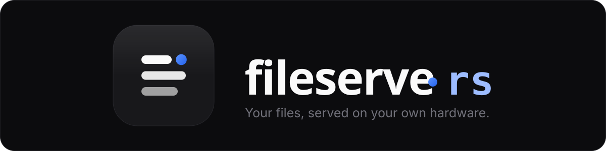
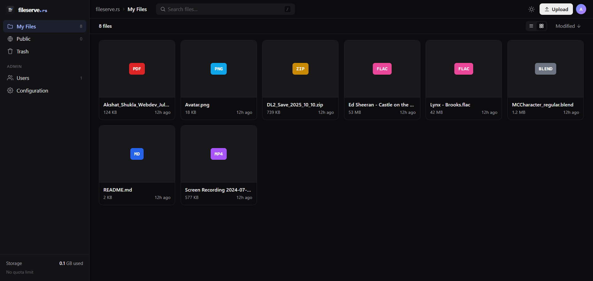
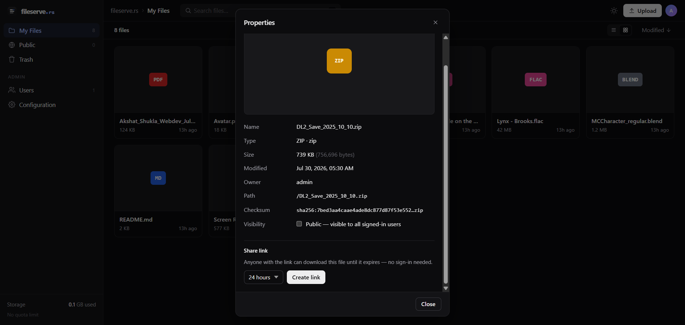
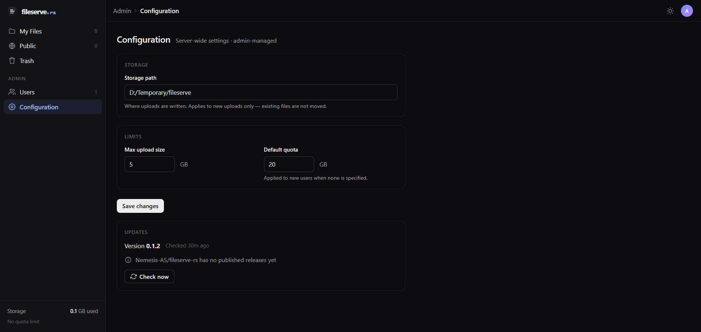

  

  
  
  
  

fileserve.rs is a file server you run yourself. Point it at a folder on your own machine and you get a fast, modern web app for uploading, browsing, previewing, and sharing files, with real accounts and admin controls, and none of your files ever touch someone else's cloud.

## Features

- **Browse and organize.** Switch between list and grid views, sort by name, type, size, or date, and search as you type. Drag files in to upload, or click to pick them. A progress dock in the corner shows every upload as it happens and keeps working even while you browse elsewhere. If you'd rather not touch the mouse, keyboard shortcuts cover search, navigation, rename, delete, and more.

- **Uploads that survive a bad connection.** Uploads are chunked and resumable, so a dropped connection doesn't mean starting over. Files are also checked against what's already on disk, so uploading the same file twice doesn't use twice the storage.

- **Preview almost anything.** Images, PDFs, video, audio, and text or code files all open right in the browser. No downloading something just to see what's inside it.

- **Trash, not delete.** Deleting a file moves it to Trash first, and a quick "Undo" toast means a slip of the finger isn't permanent. Restore it, or empty it for good when you're ready.

- **Share it your way.** Mark a file public so anyone else with an account on your server can see it, or generate a link that expires in an hour, a day, or a week and hand it to someone who doesn't need an account at all.

  

- **Built for more than one person.** Every user gets their own space and their own storage quota. Admins create accounts, assign roles, and manage the server. There's no open signup, which is exactly what you want when this is running on your own hardware.

- **Updates itself.** The server checks for new releases on its own, and an admin can install one with a click. Downloads are checksum-verified before anything is installed, and if a new build fails to start, it rolls back automatically. No SSH session required.

  

- **Looks the way you want.** Light and dark themes, three density settings for the file list, and a sidebar you can tuck away when you want more room.

- **One binary, nothing else to run.** The frontend is built into the same binary as the backend. Deploying it is copying one file to a server and running it.

## Under the hood

The backend is Rust on actix-web, storing metadata in SQLite through sqlx and handling auth with JWT sessions and bcrypt-hashed passwords. The frontend is SvelteKit 5 with Tailwind, built and embedded straight into the Rust binary at compile time, so what ships is a single executable.

## Getting started

Download the latest binary for your platform from the [releases page](https://github.com/Nemesis-AS/fileserve-rs/releases/latest) and run it. That's it, no database setup or build step, it creates what it needs on first launch and prints an admin password to the console.

Building from source instead, or setting it up to run permanently behind systemd or Docker? Full instructions are in [`INSTALL.md`](./INSTALL.md).

## Found a bug? Want a feature?

Open an issue if something's broken or missing, and feel free to open a pull request if you'd like to fix it yourself. Contributions are welcome.

## License

MIT, see [`LICENSE`](./LICENSE).
